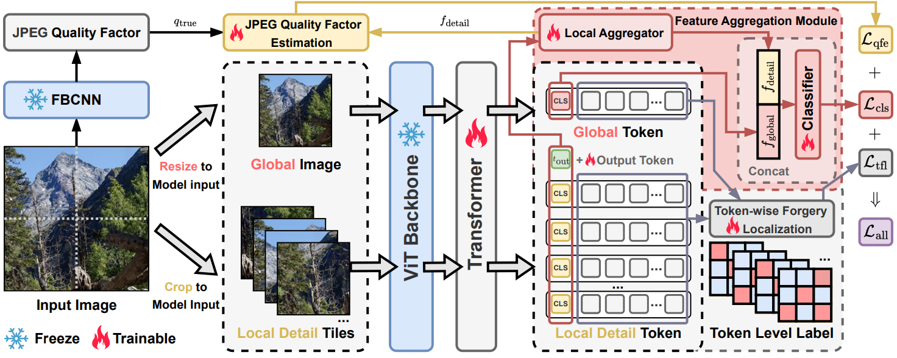

# HiDA-Net

[Paper Link](https://openreview.net/pdf?id=9QQ3Kc2hj6)

**TLDR:** We propose HiDA-Net, a detector for high-resolution AI-generated images that leverages all input pixels by integrating global context with local tile features, achieving **13%** gain on challenging Chameleon benchmark.



The rapid growth of high-resolution, meticulously crafted AI-generated images poses a significant challenge to existing detection methods, which are often trained and evaluated on low-resolution, automatically generated datasets that do not align with the complexities of high-resolution scenarios. A common practice is to resize or center-crop high-resolution images to fit standard network inputs. However, without full coverage of all pixels, such strategies risk either obscuring subtle, high-frequency artifacts or discarding information from uncovered regions, leading to input information loss. 

In this paper, we introduce the **Hi**gh-Resolution **D**etail-**A**ggregation Network (**HiDA-Net**), a novel framework that ensures no pixel is left behind. We use the *Feature Aggregation Module* (FAM) module, which fuses features from multiple full-resolution local tiles with a down-sampled global view of the image. These local features are aggregated and fused with global representations for final prediction, ensuring that native-resolution details are preserved and utilized for detection. To enhance robustness against challenges such as localized AI manipulations and compression, we introduce *Token-wise Forgery Localization* (TFL) module for fine-grained spatial sensitivity and *JPEG Quality Factor Estimation* (QFE) module to disentangle generative artifacts from compression noise explicitly. Furthermore, to facilitate future research, we introduce **HiRes-50K**, a new challenging benchmark consisting of *50,568* images with up to *64 megapixels*. Extensive experiments show that HiDA-Net achieves state-of-the-art, increasing accuracy by over **13%** on the challenging Chameleon dataset and **10%** on our HiRes-50K.

## Setup

Create a virtual environment and install requirements.

``` shell
pip install -r requirements.txt
pip install -e .
```

FBCNN model is available from this [link](https://github.com/jiaxi-jiang/FBCNN/releases/tag/v1.0). Please change `yaml` files in `.config` folder and `.utils/dataset_source.py` to configure the settings. 

## Train & Evaluation

``` shell
# For training
torchrun --standalone --nproc-per-node=1 train_HiDA.py --config configs/train.yaml
# For evaluation
torchrun --standalone --nproc-per-node=1 evaluate.py --config configs/test.yaml --weights /path/to/pth
```
## HiRes-50K Dataset

You can get this dataset from this [link](https://huggingface.co/datasets/Mu437/HiRes-50K).
